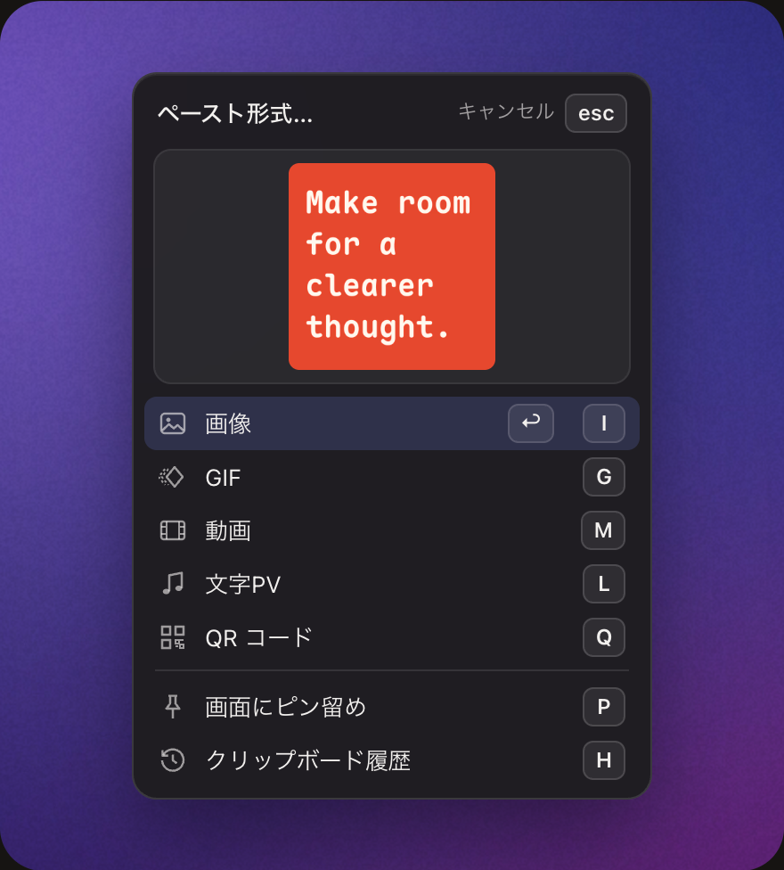
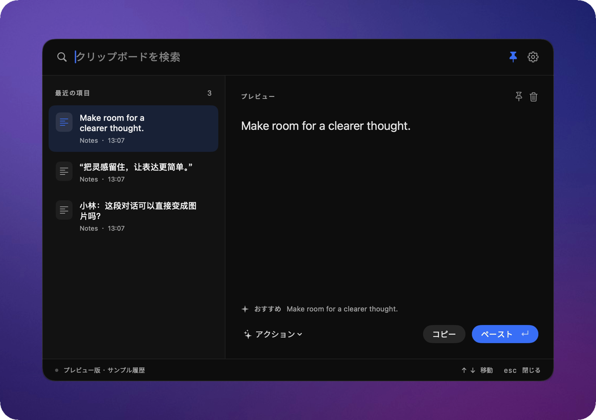

[English](README.md) · [简体中文](README.zh-CN.md) · **日本語**

# Peesuto

**テキストをコピー。カードをペースト。**

[](https://github.com/anelikes/peesuto/releases/latest)
[](LICENSE)
[](#インストール)

[ウェブサイト](https://peesuto.com/ja/) · [ダウンロード](https://github.com/anelikes/peesuto/releases/latest) · [更新履歴](CHANGELOG.md)（英語）

<p align="center">
  
</p>

Peesuto は Mac のための小さなオープンソースのクリップボードアプリです。コピーしたもの（コード、チャット、表、引用など）を読み取り、きれいに組んだ画像にして、いま入力しているところへペーストします。GIF や動画にもできます。

- **プレーンテキストからカードに。** 19 のテンプレートと 41 のスタイル。言葉、名前、数字、順番はすべて元のテキストのまま。書き換えも付け足しもしません。
- **キーひとつでペースト。** ⌥V を押すとカーソルの位置にパネルが開き、カードはもうできています。Return でペースト。
- **クリップボード履歴。** コピーしたものすべてを Mac の中で暗号化して保存。⇧⌥V で検索できます。
- **初期状態で外に出ない。** アカウントもテレメトリもありません。自分の AI キーを入れない限り、何も Mac の外に出ません。

## 使いかた



テキストをコピーして、入力中の場所で **⌥V** を押します。カーソルの位置に小さなパネルが開き、カードはもうできています。あとはキーをひとつ。**Return** なら選択中の行（最初は画像。矢印キーで動かせます）：

| キー | 出力 |
|---|---|
| **I** | 画像：PNG を、いま入力中のアプリにそのままペースト |
| **G** | GIF：同じカードを、一行ずつ表示 |
| **M** | 動画：MP4。Mac 内蔵のビデオハードウェアでエンコードします |
| **L** | 文字PV：どんなテキストも、文や句の切れ目で場面に分けた動く文字に（GIF。「設定 › テンプレート」でビデオやポスターにも） |
| **Q** | QR コード：コピーしたテキストをそのまま。モデルには送りません |
| **P** | 画面にピン留め：すべてのウィンドウの上に浮かびます。ドラッグで移動、ピンチで拡大、ダブルクリックで閉じます |
| **H** | クリップボード履歴（**⇧⌥V** でも開けます） |

画像、GIF、動画、文字PV、QR コード、ピン留めには「設定 › ショートカット」で個別のキーも割り当てられます。初期状態では未設定です。

自動でペーストするのは、カーソルが元の場所にあると確かめられたときだけです。確かめられないときは結果をクリップボードに入れるので、⌘V はご自分で押してください。その間に新しくコピーしたものが上書きされることはありません。

<br clear="right">

**⇧⌥V** でクリップボード履歴が開きます。コピーしたものすべてを Mac の中で暗号化して保存し、検索できます。ほかの場所をクリックするとすぐに隠れ、ピンで開いたままにもできます。

<p align="center">
  
</p>

## テンプレート

<p align="center">
  
</p>

テキスト · ドキュメント · 引用 · コード · 数字 · リスト · 会話 · 表 · 比較 · 図 · 情報カード · リリースノート · 文字PV · QR コード

テンプレートはローカルのルールが選びます。ペーストしたあとでスタイルを変えられるほか、「設定 › テンプレート」でテンプレートごとの既定のスタイル、使わないテンプレートのオフ、カードのフォント、署名の一行を設定できます。コードは 24 言語のシンタックスハイライトに対応。タブ区切り、Markdown、ターミナルの罫線表は表に、Mermaid のフローチャートや矢印でつないだ手順は図になります。著者名は、元のテキストにあるときだけ表示します。カードは描く前に必ずチェックされ、コピーした内容が少しでも欠けそうなときは、不完全なカードをペーストせずにそう伝えます。詳しくは[テンプレートの仕組み](docs/templates.md)（英語）へ。

## プライバシー

- **ローカルで処理。** 解析も組版もレンダリングも Mac の中。テンプレートはローカルのルールが選ぶので、モデルは要りません。
- **履歴は暗号化**して保存し、鍵はキーチェーンに置きます。
- **パスワードは記録しない。** パスワードマネージャーや保護された入力欄からのコピーは記録しません。
- **アカウントも、テレメトリも、アクセス解析もありません。**
- **AI は任意、自分のキーで。** キーを入れたときだけ、コピーしたテキストを API キーやトークンなどの秘密情報を伏せたうえでそのサービスに送ります。モデルが選ぶのはスタイルだけで、言葉には触れません。設定のオフラインスイッチひとつで、通信をすべて止められます。

詳しくは[プライバシーポリシー](https://peesuto.com/privacy/)（英語）と [SECURITY.md](SECURITY.md)（英語）へ。

## インストール

1. [最新リリース](https://github.com/anelikes/peesuto/releases/latest)から DMG をダウンロードし、Peesuto を「アプリケーション」にドラッグします。Homebrew なら `brew install --cask anelikes/tap/peesuto` でも入ります。
2. 起動すると、3 ステップのガイドがショートカットと必要な許可を案内します。
3. 求められたら **アクセシビリティ** を許可します（システム設定 › プライバシーとセキュリティ › アクセシビリティ）。入力中のアプリにペーストするため、カーソルの位置にパネルを開くため、そしてペーストの直前にカーソルが動いていないかを確かめるために使います。許可しなくてもコピーと履歴は使えます。

**動作環境：** Apple シリコン搭載で、macOS 13 Ventura 以降の Mac。ほかに必要なものはありません。動画は Mac 内蔵の H.264 エンコーダで作ります。

**アップデートは自動です。** 1 日に 1 回確認し、署名済みのアップデートがあればお知らせします（Sparkle）。自動確認は「設定 › 一般」でオフにできます。0.1.0 と 0.1.1 はアップデート機能より前の版なので、一度だけ手動で更新してください。

## よくある質問

<details>
<summary><b>Mac の外に出るデータはありますか？</b></summary>

初期状態では何も出ません。AI サービスを設定したときだけ、コピーしたテキストが秘密情報を伏せたうえで、あなたのキーでそのサービスに送られます。設定のオフラインスイッチひとつで、すべて止められます。すべてのケースは[プライバシーポリシー](https://peesuto.com/privacy/)（英語）に書いてあります。
</details>

<details>
<summary><b>AI のキーは必要ですか？</b></summary>

いいえ。テンプレートはすべてローカルのルールで選べます。お好みで、自分の API キーを入れて小さなモデル Jev にテンプレートとスタイルを選ばせることもできます。TypeSafe、Vercel AI Gateway、OpenRouter、またはご自身の Cloudflare アカウントから使えます。Jev が決めるのは見せ方だけで、文章を書き換えることはありません。
</details>

<details>
<summary><b>なぜ「アクセシビリティ」の許可が必要なのですか？</b></summary>

入力中のアプリにペーストするため、カーソルの位置にパネルを開くため、そしてペーストの直前にカーソルが元の場所にあるかを確かめるためです。許可しない場合、結果はクリップボードに入るので、⌘V はご自分で押してください。
</details>

<details>
<summary><b>システム設定でアクセシビリティをオンにしたのに、オフと表示されます。</b></summary>

アップデートのあとなどに、macOS が古い許可の記録を残していることがあります。「システム設定 › プライバシーとセキュリティ › アクセシビリティ」で Peesuto を選び、**−** で削除してから **+** でもう一度追加してください（または Peesuto を開き直し、表示に従って許可します）。
</details>

<details>
<summary><b>料金はかかりますか？</b></summary>

かかりません。Peesuto は MIT ライセンスのオープンソースで、オープンソース版から外している機能もありません。
</details>

## 開発

Peesuto は 3 つの部分でできています。

- **`native/`**：SwiftUI + AppKit で書いた macOS アプリ。履歴、パネル、設定、権限、アップデートを担当します。デスクトップ実装はこれだけで、WebView も Electron も使いません。
- **`core/`**：Bun 上で動く TypeScript の Core。アプリに同梱され、ローカルのサイドカーとして動きます。解析、テンプレートの選択、プロバイダとアクション、レンダリング、GIF/MP4 の書き出しを担当し、コマンドライン（`bun run paste`）からも使えます。
- **[Pocket Motion](https://github.com/anelikes/pocket-motion)**：レンダリングエンジン。別リポジトリで、バージョンは `engine.json` で固定しています。

内容は元のテキストからローカルで解析します。判定役（初期状態はローカルのルール）が選べるのは有効なテンプレート、スタイル、モーションの中からだけで、言葉、数字、発言者、表のセルを置き換えたり作り出したりはできません。

必要なもの：macOS 13 以降、Xcode 16.4 以降、Bun 1.3.x、`wasm32-unknown-unknown` ターゲット入りの Rust（エンジンのラスタライザ用）。

```bash
bun install
bun run setup                     # 固定バージョンのエンジンを engine/ に取得・準備
bun test core/tests
bun run typecheck
swift test --package-path native

bun scripts/fetch-emoji.ts        # 最初に一度：絵文字を同梱してオフラインで使えるように
bun scripts/build-native.ts --engine /absolute/path/to/prepared-pocket-motion
open native/dist/Peesuto.app
```

AI プロバイダごとに何がどこへ送られるかは、英語版 README の [What leaves the machine](README.md#what-leaves-the-machine) にまとめています。

- [CONTRIBUTING.md](CONTRIBUTING.md)：環境構築、エンジンのルール、ダイジェスト、コミットと署名（英語）
- [docs/development.md](docs/development.md)：リポジトリ構成、`paste` CLI、モデルの 2 系統、文字の計測（英語）
- [docs/templates.md](docs/templates.md)：テンプレート、スタイル、その制約（英語）
- [docs/RELEASING.md](docs/RELEASING.md)：署名、公証、DMG、アップデート（英語）
- [docs/site.md](docs/site.md)：peesuto.com のウェブサイト（英語）
- [native/README.md](native/README.md)：ネイティブアプリのビルドとスモークテスト（中国語）

セキュリティの問題は公開の issue ではなく、contact@peesuto.com までメールでお知らせください。

## ライセンスとクレジット

[MIT](LICENSE)。サードパーティのコンポーネントとそのライセンスは [NOTICE](NOTICE) にあります。「Peesuto」の名称とロゴは商標で、ライセンスの対象外です。[Trademarks](CONTRIBUTING.md#trademarks)（英語）をご覧ください。

[Pocket Motion](https://github.com/anelikes/pocket-motion)（レンダリング）、[Maple Mono](https://github.com/subframe7536/maple-font)（カードのフォント）、[JetBrains Mono](https://github.com/JetBrains/JetBrainsMono)（キーボード記号）、[highlight.js](https://highlightjs.org/)（シンタックスハイライト）、[Sparkle](https://sparkle-project.org/)（アップデート）を使っています。
