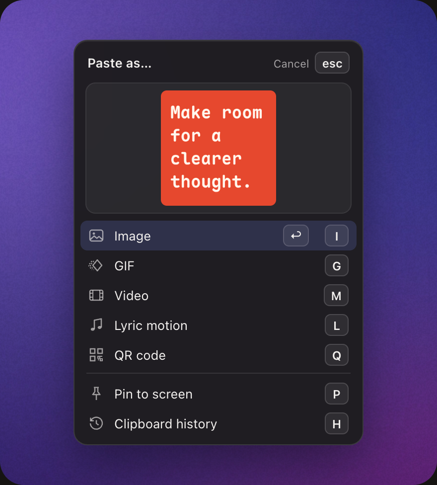

**English** · [简体中文](README.zh-CN.md) · [日本語](README.ja.md)

# Peesuto

**Copy text. Paste a card.**

[](https://github.com/anelikes/peesuto/releases/latest)
[](LICENSE)
[](#install)

[Website](https://peesuto.com) · [Download](https://github.com/anelikes/peesuto/releases/latest) · [Changelog](CHANGELOG.md)

<p align="center">
  
</p>

Peesuto is a small, open-source clipboard app for the Mac. It sees what you
copied (code, a chat, a table, a quote) and pastes it as a well-set image
into whatever you are typing in. GIF and video too.

- **Cards from plain text.** 13 templates, 27 styles. Words, names, numbers
  and order come from your text; nothing is rewritten or made up.
- **One key to paste.** ⌥V opens a chooser at your caret with the card
  already drawn; Return pastes it.
- **Clipboard history.** Everything you copy, encrypted on your Mac and
  searchable with ⇧⌥V.
- **Private by default.** No account, no telemetry. Nothing leaves your Mac
  unless you add your own AI key.

## How it works



Copy some text, then press **⌥V** wherever you are typing. A small
**Paste as…** chooser opens at the caret with the card already drawn. One
more key:

| Key | Output |
|---|---|
| **Return** | Image: a PNG, pasted into the app you are typing in |
| **G** | GIF: the same card, revealed line by line |
| **M** | Video: MP4, made with the ffmpeg on your Mac |
| **Q** | QR code: exactly the text you copied; never sent to a model |
| **P** | Pin to screen: floats above every window; drag, pinch to zoom, double-click to close |
| **H** | Clipboard history (also **⇧⌥V**) |

**⇧⌥V** opens the clipboard history: everything you copied, encrypted on
your Mac and searchable. The panel hides as soon as you click elsewhere and
can be pinned open.

Image, GIF, video, QR code and pin can each get a direct shortcut in
Settings › Shortcuts. They are unbound by default. Peesuto pastes only when
it can verify the caret is still where you left it; otherwise the result is
copied and you press ⌘V yourself. Something you copied in the meantime is
never overwritten.

<br clear="right">

## Templates

<p align="center">
  
</p>

Text · Document · Quote · Code · Statistic · List · Conversation · Table ·
Comparison · Diagram · Info card · Release notes · QR code

Local rules pick the template. After pasting you can switch the style; in
Settings › Templates you can choose a default style per template, turn
templates off, pick the card font and add a signature line. Code gets real
syntax highlighting in 24 languages; tables come from tab-separated,
Markdown or terminal box text; Mermaid flowcharts and arrow chains become
diagrams; an author is shown only when your text has one. Every card is
checked before it is drawn: if anything you copied would be missing,
Peesuto says so instead of pasting an incomplete card.
[How templates work](docs/templates.md).

## Privacy

- **Local.** Parsing, layout and rendering run on your Mac. Local rules
  choose the template; no model is needed.
- **Encrypted history**, with the key in your Keychain.
- **Passwords skipped.** Copies from password managers and secure fields are
  never recorded.
- **No account, no telemetry, no analytics.**
- **Optional AI, with your own key.** If you add one, copied text is sent to
  that provider with secrets such as API keys and tokens redacted first.
  The model picks the style, never the words. One offline switch in Settings
  stops all network use.

Details: [privacy policy](https://peesuto.com/privacy/) ·
[SECURITY.md](SECURITY.md) · [what leaves the machine](#what-leaves-the-machine)

## Install

1. Download the DMG from the
   [latest release](https://github.com/anelikes/peesuto/releases/latest) and
   drag Peesuto into Applications, or use Homebrew:
   `brew install --cask anelikes/tap/peesuto`.
2. Open it. A three-step welcome guide walks you through the shortcuts and
   permissions.
3. Allow **Accessibility** when asked (System Settings › Privacy & Security ›
   Accessibility). Peesuto needs it to paste into the app you are typing in,
   to open the chooser at your caret, and to check that the caret has not
   moved before pasting. Copying and history work without it.

**Requirements:** a Mac with Apple silicon, macOS 13 Ventura or later.
[ffmpeg](https://ffmpeg.org) (`brew install ffmpeg`) only for MP4 video;
Peesuto does not bundle or install it.

**Updates** are automatic: Peesuto checks once a day and offers signed
updates (Sparkle). Turn the check off in Settings › General. Versions 0.1.0
and 0.1.1 came before the updater, so update those once by hand.

## FAQ

<details>
<summary><b>Does anything leave my Mac?</b></summary>

By default, nothing. Only if you set up an AI provider is copied text sent,
with secrets redacted first, to that provider with your key. The offline
switch in Settings stops all of it. The
[privacy policy](https://peesuto.com/privacy/) lists every case.
</details>

<details>
<summary><b>Do I need an AI key?</b></summary>

No. Local rules choose a template for everything. If you like, bring your own
key and let Jev, a small model, choose the template and style, through
TypeSafe, Vercel AI Gateway, OpenRouter or your own Cloudflare account. It
picks presentation only; it never rewrites your text.
</details>

<details>
<summary><b>Why does it ask for Accessibility access?</b></summary>

To paste into the app you are typing in, to open the chooser at your caret,
and to check that the caret is still where you left it before pasting.
Without the permission, the result is copied and you press ⌘V yourself.
</details>

<details>
<summary><b>Accessibility is on in System Settings, but Peesuto says it is off.</b></summary>

macOS sometimes keeps a stale entry, for example after an update. Open
System Settings › Privacy & Security › Accessibility, select Peesuto, remove
it with **−**, then add it again with **+** (or reopen Peesuto and allow it
when asked).
</details>

<details>
<summary><b>What does it cost?</b></summary>

Nothing. Peesuto is free and MIT-licensed, and no feature is held back from
the open-source build.
</details>

## Development

Peesuto is three parts:

- **`native/`** — the macOS app in SwiftUI + AppKit: history, the chooser,
  settings, permissions, updates. The only desktop implementation (no
  WebView, no Electron).
- **`core/`** — Core in TypeScript on Bun, bundled into the app and run as a
  local sidecar: parsing, template choice, providers and actions, rendering
  and GIF/MP4 export. Also usable from the command line (`bun run paste`).
- **[Pocket Motion](https://github.com/anelikes/pocket-motion)** — the
  rendering engine, a separate repository pinned in `engine.json`.

Content is parsed locally from your text. A decision provider (local rules
by default) may only choose among valid templates, styles and motions; it
cannot replace or invent words, numbers, speakers or table cells. Actions
(translate, summarise, your own prompt) are JSON files; see
[docs/actions.md](docs/actions.md).

### Build and test

Needs macOS 13+, Xcode 16.4+, Bun 1.3.x and Rust with the
`wasm32-unknown-unknown` target (for the engine's rasteriser).

```bash
bun install
bun run setup                     # fetch and prepare the pinned engine into engine/
bun test core/tests               # unit tests; fixture renders skip without an engine
bun run typecheck
swift test --package-path native

bun scripts/fetch-emoji.ts        # once: include the emoji set for offline use
bun scripts/build-native.ts --engine /absolute/path/to/prepared-pocket-motion
open native/dist/Peesuto.app      # --preview builds an isolated app with sample history
```

The local build is ad-hoc signed; `scripts/release-native.ts` adds Developer
ID signing, notarization and the Sparkle feed.

- [CONTRIBUTING.md](CONTRIBUTING.md) — setup, the engine rules, digests, commits and sign-off
- [docs/development.md](docs/development.md) — repository layout, the `paste` CLI, model tracks, text measurement
- [docs/templates.md](docs/templates.md) — templates, styles and their limits
- [docs/RELEASING.md](docs/RELEASING.md) — signing, notarization, DMG and updates
- [docs/site.md](docs/site.md) — the peesuto.com website
- [native/README.md](native/README.md) — native build and smoke commands (Chinese)

### What leaves the machine

Only when you chose that provider:

| provider | what is sent | to |
|---|---|---|
| decider `rules` (the default) | nothing | — |
| decider `none` | nothing | — |
| decider `laya` | the typed questions and the text they are about | the local URL you run `scripts/laya/server.py` at, `127.0.0.1` unless you change it |
| decider `cloudflare` | the typed questions and the text they are about | your own Workers AI account |
| decider `typesafe` / `vercel` / `openrouter` | the same | Jev at TypeSafe, Vercel AI Gateway or OpenRouter, with your own key |
| decider `endpoint` | the same | the URL you set (your own proxy, or ours) |
| generator `openai-compatible` / `anthropic` | the filled prompt | the base URL you set |
| generator `openrouter` / `vercel` | the filled prompt | the gateway's OpenAI-compatible API, with the same key as its Jev |
| generator `hosted` | the filled prompt | our proxy, which does not store it (not live yet) |

Text sent to a model is redacted by default (API keys, private keys, tokens,
credentials in URLs, secret assignments). The offline switch in Settings
closes the single egress path for everything above. Emoji pictures are
fetched by codepoint from a CDN once and cached; that reveals which emoji,
not the text. History is stored encrypted with a key in your Keychain. See
[SECURITY.md](SECURITY.md).

Security reports: contact@peesuto.com (please not a public issue).

## License and credits

[MIT](LICENSE). Third-party components and their licenses are listed in
[NOTICE](NOTICE). "Peesuto" and its logo are trademarks and are not covered
by the license; see [Trademarks](CONTRIBUTING.md#trademarks).

Built with [Pocket Motion](https://github.com/anelikes/pocket-motion)
(rendering), [Maple Mono](https://github.com/subframe7536/maple-font) (the
card font), [JetBrains Mono](https://github.com/JetBrains/JetBrainsMono)
(keyboard symbols), [highlight.js](https://highlightjs.org/) (syntax
highlighting) and [Sparkle](https://sparkle-project.org/) (updates).
