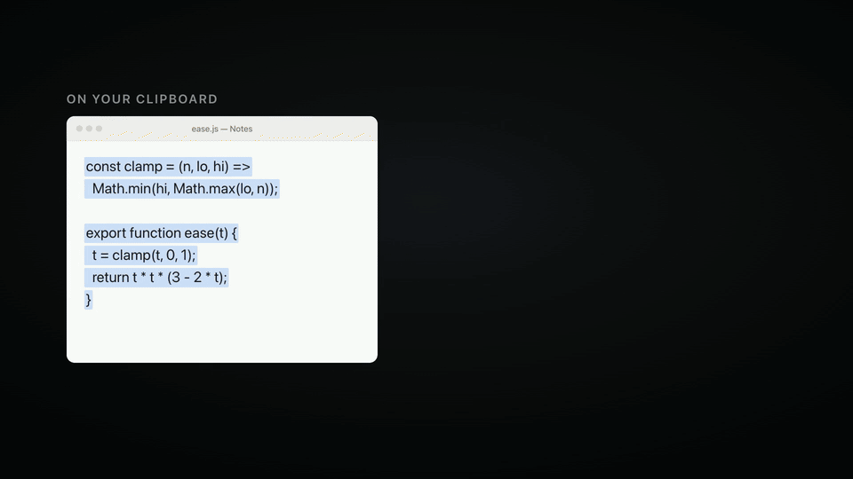
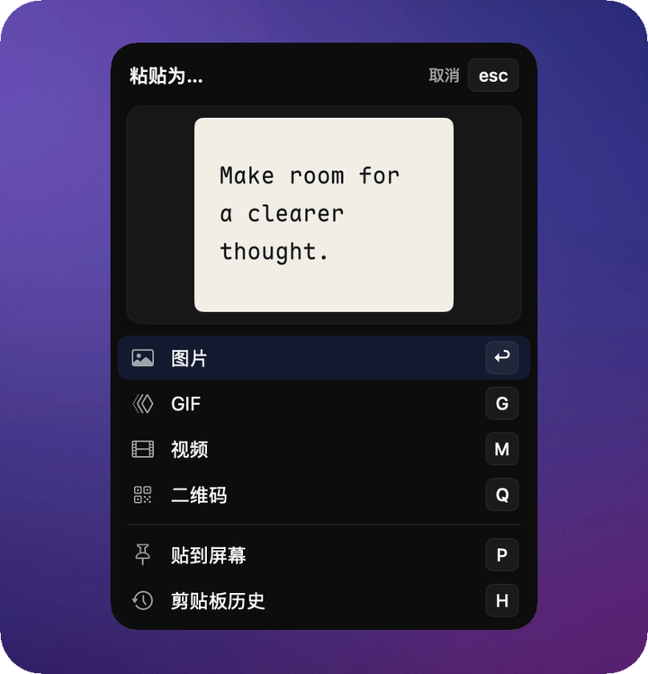
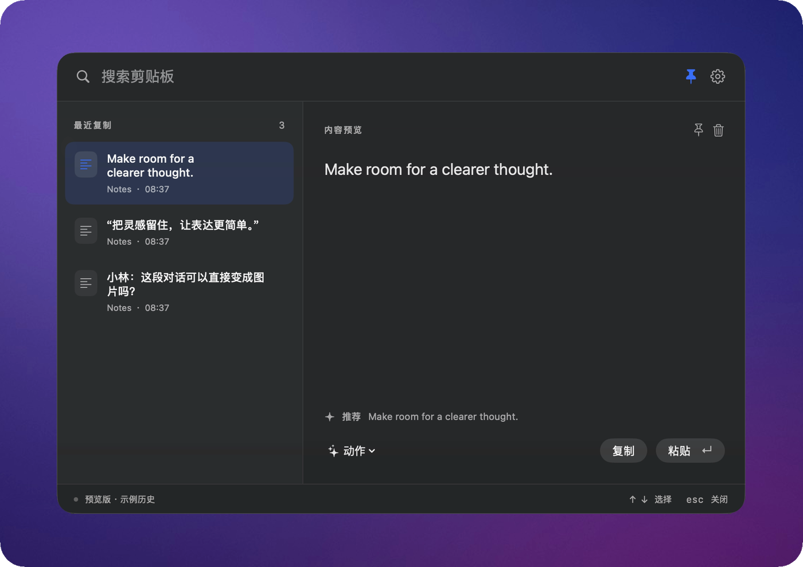
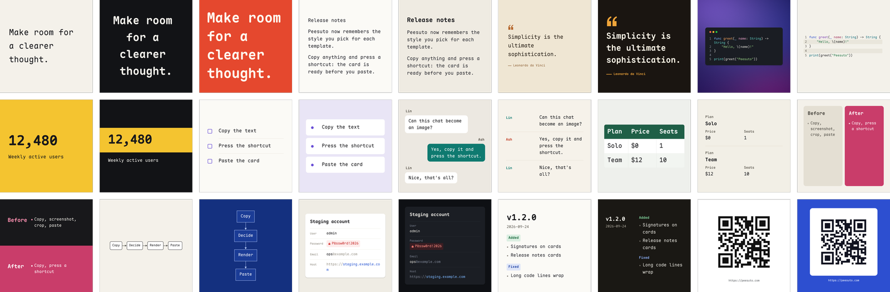

[English](README.md) · **简体中文** · [日本語](README.ja.md)

# Peesuto

**复制文字，粘贴成卡片。**

[](https://github.com/anelikes/peesuto/releases/latest)
[](LICENSE)
[](#安装)

[官网](https://peesuto.com/zh/) · [下载](https://github.com/anelikes/peesuto/releases/latest) · [更新日志](CHANGELOG.md)（英文）

<p align="center">
  
</p>

Peesuto 是一款小巧的开源 Mac 剪贴板应用。它看得懂你复制的内容，比如代码、聊天记录、表格、引语，把它排成一张好看的图片，直接粘贴到你正在输入的地方。也能生成 GIF 和视频。

- **纯文本变卡片。** 13 种模板，27 种样式。字词、人名、数字和顺序都来自原文，不改写，不编造。
- **一个快捷键粘贴。** 按 ⌥V，光标处弹出选择面板，卡片已经画好，回车即可粘贴。
- **剪贴板历史。** 复制过的所有内容都加密保存在本机，按 ⇧⌥V 随时搜索。
- **默认不联网。** 没有账号，没有遥测。除非你自己填了 AI 密钥，否则什么都不会离开这台 Mac。

## 怎么用



复制一段文字，在任何输入的地方按 **⌥V**。光标处会打开一个“**粘贴为…**”的小面板，卡片已经画好。再按一个键：

| 按键 | 结果 |
|---|---|
| **回车** | 图片：PNG，直接粘贴进你正在输入的应用 |
| **G** | GIF：同一张卡片，逐行出现 |
| **M** | 视频：MP4，用你 Mac 上的 ffmpeg 生成 |
| **Q** | 二维码：编码的就是你复制的原文，不会发给任何模型 |
| **P** | 贴到屏幕：浮在所有窗口之上；可拖动、捏合缩放，双击关闭 |
| **H** | 剪贴板历史（也可以直接按 **⇧⌥V**） |

图片、GIF、视频、二维码和贴到屏幕也可以在“设置 › 快捷键”里各自绑定快捷键，默认不绑定。

只有确认光标还在原来的位置，Peesuto 才会自动粘贴；否则结果会放进剪贴板，由你自己按 ⌘V。期间你新复制的内容不会被覆盖。

<br clear="right">

按 **⇧⌥V** 打开剪贴板历史：复制过的所有内容，加密保存在本机，可以搜索。点击别处面板就会收起，也可以把它钉住。

<p align="center">
  
</p>

## 模板

<p align="center">
  
</p>

文本 · 文档 · 引用 · 代码 · 数字 · 列表 · 对话 · 表格 · 对比 · 流程图 · 信息卡 · 更新日志 · 二维码

模板由本地规则挑选。粘贴后可以换样式；在“设置 › 模板”里可以为每个模板选默认样式、关掉不需要的模板、选择卡片字体、加一行署名。代码支持 24 种语言的语法高亮；制表符分隔、Markdown 和终端里的框线表格都认得；Mermaid 流程图和箭头链会画成流程图；原文写了作者，卡片上才会署名。每张卡片绘制前都会检查：如果你复制的内容有任何一部分放不下，Peesuto 会直接告诉你，而不是粘贴一张不完整的卡片。详见[模板说明](docs/templates.md)（英文）。

## 隐私

- **本地处理。** 解析、排版和渲染都在本机完成。模板由本地规则选择，不需要任何模型。
- **历史加密保存**，密钥存放在钥匙串里。
- **不记录密码。** 从密码管理器和安全输入框复制的内容一律不记录。
- **没有账号，没有遥测，没有统计。**
- **AI 可选，用你自己的密钥。** 只有填了密钥，复制的文字才会发给该服务商，发送前先把 API 密钥、令牌等敏感信息脱敏。模型只挑样式，不碰文字。设置里的离线开关可以一键切断所有网络访问。

详见[隐私政策](https://peesuto.com/privacy/)（英文）和 [SECURITY.md](SECURITY.md)（英文）。

## 安装

1. 从 [最新版本](https://github.com/anelikes/peesuto/releases/latest) 下载 DMG，把 Peesuto 拖进“应用程序”。
2. 打开它，三步欢迎向导会介绍快捷键和所需权限。
3. 按提示允许 **辅助功能**（系统设置 › 隐私与安全性 › 辅助功能）。Peesuto 需要它把结果粘贴进你正在使用的应用、在光标处打开面板，并在粘贴前确认光标没有移动。不授权也能正常复制和查看历史。

**系统要求：** 搭载 Apple 芯片、运行 macOS 13 Ventura 或更高版本的 Mac。只有生成 MP4 视频时需要 [ffmpeg](https://ffmpeg.org)（`brew install ffmpeg`），Peesuto 不会自带或自动安装。

**自动更新：** Peesuto 每天检查一次，有新版本时提示安装经过签名的更新（Sparkle），可以在“设置 › 通用”里关闭。0.1.0 和 0.1.1 早于更新器，需要手动更新一次。

## 常见问题

<details>
<summary><b>哪些数据会离开我的 Mac？</b></summary>

默认什么都不会。只有当你配置了 AI 服务，复制的文字才会先脱敏，再用你的密钥发给该服务商。设置里的离线开关可以一键全部切断。[隐私政策](https://peesuto.com/privacy/)（英文）列出了每一种情况。
</details>

<details>
<summary><b>必须有 AI 密钥吗？</b></summary>

不必。本地规则就能为所有内容选好模板。如果愿意，也可以填入自己的密钥，让小模型 Jev 来挑模板和样式，支持 TypeSafe、Vercel AI Gateway、OpenRouter 或你自己的 Cloudflare 账号。它只负责选择呈现方式，从不改写你的文字。
</details>

<details>
<summary><b>为什么需要“辅助功能”权限？</b></summary>

为了把结果粘贴进你正在使用的应用、在光标处打开选择面板，并在粘贴前确认光标还在原来的位置。不授权时，结果会放进剪贴板，由你自己按 ⌘V。
</details>

<details>
<summary><b>系统设置里已经打开了辅助功能，Peesuto 却说没开？</b></summary>

macOS 有时会留下失效的授权记录，比如在更新之后。打开“系统设置 › 隐私与安全性 › 辅助功能”，选中 Peesuto，用 **−** 移除，再用 **+** 重新添加（或者重新打开 Peesuto，按提示授权）。
</details>

<details>
<summary><b>收费吗？</b></summary>

免费。Peesuto 以 MIT 许可证开源，开源版本没有任何功能保留。
</details>

## 开发

Peesuto 由三部分组成：

- **`native/`**：SwiftUI + AppKit 编写的 macOS 应用，负责历史、选择面板、设置、权限和更新。这是唯一的桌面实现，不用 WebView，也不用 Electron。
- **`core/`**：基于 Bun 的 TypeScript Core，打包进应用，作为本地 sidecar 运行，负责解析、模板选择、服务商与动作、渲染以及 GIF/MP4 导出；也可以在命令行里用（`bun run paste`）。
- **[Pocket Motion](https://github.com/anelikes/pocket-motion)**：渲染引擎，独立仓库，版本固定在 `engine.json`。

内容在本地从原文解析。决策方（默认是本地规则）只能在合法的模板、样式和动效之间选择，不能替换或编造文字、数字、发言人和表格内容。

需要 macOS 13+、Xcode 16.4+、Bun 1.3.x，以及带 `wasm32-unknown-unknown` target 的 Rust（用于引擎的光栅化器）。

```bash
bun install
bun run setup                     # 拉取并准备固定版本的引擎到 engine/
bun test core/tests
bun run typecheck
swift test --package-path native

bun scripts/fetch-emoji.ts        # 仅需一次：内置 emoji，离线可用
bun scripts/build-native.ts --engine /absolute/path/to/prepared-pocket-motion
open native/dist/Peesuto.app
```

每种 AI 服务商会发送什么、发到哪里，见英文 README 的 [What leaves the machine](README.md#what-leaves-the-machine) 一节。

- [CONTRIBUTING.md](CONTRIBUTING.md)：环境搭建、引擎规则、帧摘要（digests）、提交规范与签署（英文）
- [docs/development.md](docs/development.md)：仓库结构、`paste` 命令行、模型通道、文字测量（英文）
- [docs/templates.md](docs/templates.md)：模板、样式及其限制（英文）
- [docs/RELEASING.md](docs/RELEASING.md)：签名、公证、DMG 与更新（英文）
- [docs/site.md](docs/site.md)：peesuto.com 网站（英文）
- [native/README.md](native/README.md)：原生应用的构建与冒烟测试命令

安全问题请发邮件到 contact@peesuto.com，不要公开提 issue。

## 许可证与致谢

[MIT](LICENSE)。第三方组件及其许可证见 [NOTICE](NOTICE)。“Peesuto”名称及标志为商标，不在许可证授权范围内，详见 [Trademarks](CONTRIBUTING.md#trademarks)（英文）。

感谢 [Pocket Motion](https://github.com/anelikes/pocket-motion)（渲染）、[Maple Mono](https://github.com/subframe7536/maple-font)（卡片字体）、[JetBrains Mono](https://github.com/JetBrains/JetBrainsMono)（键盘符号）、[highlight.js](https://highlightjs.org/)（语法高亮）和 [Sparkle](https://sparkle-project.org/)（自动更新）。
